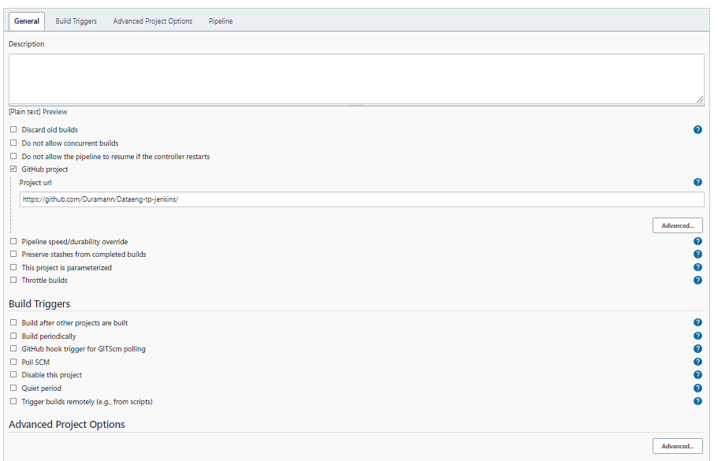
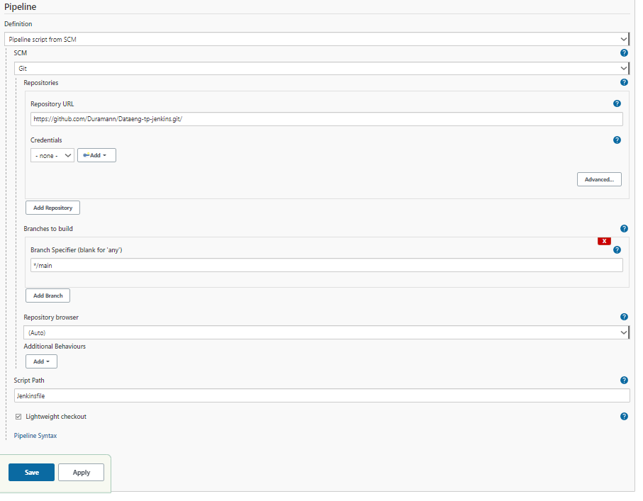
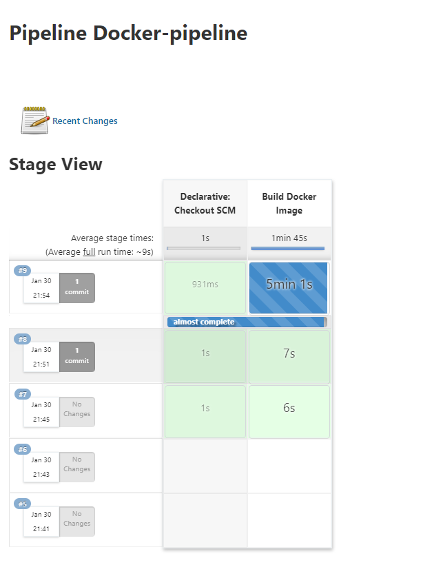

# Build a Dockerized node application using a Jenkins pipeline.

Théo Dura's work for the practical lab.

In this README you will find the desired screenshots.

## Jenkins build configuration:

  
  

## Build success screen:

  

## Console output on build success:

<pre><code class="language-nohighlight">
Started by user Théo Dura
Obtained Jenkinsfile from git https://github.com/Duramann/Dataeng-tp-jenkins.git/
[Pipeline] Start of Pipeline
[Pipeline] node
Running on Jenkins in C:\ProgramData\Jenkins\.jenkins\workspace\Docker-pipeline
[Pipeline] {
[Pipeline] stage
[Pipeline] { (Declarative: Checkout SCM)
[Pipeline] checkout
The recommended git tool is: NONE
No credentials specified
 > D:\Git\bin\git.exe rev-parse --resolve-git-dir C:\ProgramData\Jenkins\.jenkins\workspace\Docker-pipeline\.git # timeout=10
Fetching changes from the remote Git repository
 > D:\Git\bin\git.exe config remote.origin.url https://github.com/Duramann/Dataeng-tp-jenkins.git/ # timeout=10
Fetching upstream changes from https://github.com/Duramann/Dataeng-tp-jenkins.git/
 > D:\Git\bin\git.exe --version # timeout=10
 > git --version # 'git version 2.35.0.windows.1'
 > D:\Git\bin\git.exe fetch --tags --force --progress -- https://github.com/Duramann/Dataeng-tp-jenkins.git/ +refs/heads/*:refs/remotes/origin/* # timeout=10
 > D:\Git\bin\git.exe rev-parse "refs/remotes/origin/main^{commit}" # timeout=10
Checking out Revision 1f6e314895d3164d102fdbb2b048587985a1cf57 (refs/remotes/origin/main)
 > D:\Git\bin\git.exe config core.sparsecheckout # timeout=10
 > D:\Git\bin\git.exe checkout -f 1f6e314895d3164d102fdbb2b048587985a1cf57 # timeout=10
Commit message: "Update Dockerfile"
 > D:\Git\bin\git.exe rev-list --no-walk 60cd13ede6857373437fcb1d4e7967adeaf1253a # timeout=10
[Pipeline] }
[Pipeline] // stage
[Pipeline] withEnv
[Pipeline] {
[Pipeline] stage
[Pipeline] { (Build Docker Image)
[Pipeline] bat

C:\ProgramData\Jenkins\.jenkins\workspace\Docker-pipeline>docker-compose up --build 
Building image
#1 [internal] load build definition from Dockerfile
#1 sha256:fd9be65f444a1faba684e2a2560e3e86808fda64daeeebe6c6742d58c879a4a3
#1 transferring dockerfile: 209B done
#1 DONE 0.0s

#2 [internal] load .dockerignore
#2 sha256:48146cdb36136693c1609cc621f3fdc0d0b1a04436b7ff310cc3b5a7f768dcfa
#2 transferring context: 2B done
#2 DONE 0.0s

#3 [internal] load metadata for docker.io/library/node:13.12.0-alpine
#3 sha256:7a1a72ff8148156192d68592c9809f3d6147be49eb29336086fbb940e33011b7
#3 DONE 0.6s

#4 [1/6] FROM docker.io/library/node:13.12.0-alpine@sha256:cc85e728fab3827ada20a181ba280cae1f8b625f256e2c86b9094d9bfe834766
#4 sha256:c39e6bd976e9cf3bd73c3708f29bc33be4e2f56725e378bd51887e21a56c9e68
#4 DONE 0.0s

#6 [internal] load build context
#6 sha256:168a991e291284fb0288caee8643a00b4f45542a4251251aaa2962fab881d1ff
#6 transferring context: 11.25kB 0.0s done
#6 DONE 0.0s

#5 [2/6] WORKDIR /app
#5 sha256:478607c5d48d2db0f1f7864bd603bcf1a1bd29c5f1a6d9c16395ee6e7a3c9cfa
#5 CACHED

#7 [3/6] COPY package.json ./
#7 sha256:0fd137b75ea6b04dfbf9ae547702d3e8194cd8ddd7872d3b35b9836fbb194129
#7 CACHED

#8 [4/6] COPY package-lock.json ./
#8 sha256:d8faabe69956136748ff4f313d08e42cc4dcf0cd5719fb223b170f17830f14d3
#8 CACHED

#9 [5/6] RUN npm i
#9 sha256:fee935fc7caf9b6283c5a4ed97f69cdd69dde51e9652bc811ac6877ef9f65c5f
#9 0.755 npm WARN read-shrinkwrap This version of npm is compatible with lockfileVersion@1, but package-lock.json was generated for lockfileVersion@2. I'll try to do my best with it!
#9 28.31 
#9 28.31 > core-js@3.20.3 postinstall /app/node_modules/core-js
#9 28.31 > node -e "try{require('./postinstall')}catch(e){}"
#9 28.31 
#9 28.35 Thank you for using core-js ( https://github.com/zloirock/core-js ) for polyfilling JavaScript standard library!
#9 28.35 
#9 28.35 The project needs your help! Please consider supporting of core-js:
#9 28.35 > https://opencollective.com/core-js 
#9 28.35 > https://patreon.com/zloirock 
#9 28.35 > https://paypal.me/zloirock 
#9 28.35 > bitcoin: bc1qlea7544qtsmj2rayg0lthvza9fau63ux0fstcz 
#9 28.35 
#9 28.35 Also, the author of core-js ( https://github.com/zloirock ) is looking for a good job -)
#9 28.35 
#9 28.36 
#9 28.36 > core-js-pure@3.20.3 postinstall /app/node_modules/core-js-pure
#9 28.36 > node -e "try{require('./postinstall')}catch(e){}"
#9 28.36 
#9 28.40 Thank you for using core-js ( https://github.com/zloirock/core-js ) for polyfilling JavaScript standard library!
#9 28.40 
#9 28.40 The project needs your help! Please consider supporting of core-js:
#9 28.40 > https://opencollective.com/core-js 
#9 28.40 > https://patreon.com/zloirock 
#9 28.40 > https://paypal.me/zloirock 
#9 28.40 > bitcoin: bc1qlea7544qtsmj2rayg0lthvza9fau63ux0fstcz 
#9 28.40 
#9 28.40 Also, the author of core-js ( https://github.com/zloirock ) is looking for a good job -)
#9 28.40 
#9 29.58 npm WARN optional SKIPPING OPTIONAL DEPENDENCY: fsevents@2.3.2 (node_modules/fsevents):
#9 29.58 npm WARN notsup SKIPPING OPTIONAL DEPENDENCY: Unsupported platform for fsevents@2.3.2: wanted {"os":"darwin","arch":"any"} (current: {"os":"linux","arch":"x64"})
#9 29.58 
#9 29.59 added 1384 packages from 644 contributors and audited 1385 packages in 28.873s
#9 30.43 
#9 30.43 168 packages are looking for funding
#9 30.43   run `npm fund` for details
#9 30.43 
#9 30.43 found 2 moderate severity vulnerabilities
#9 30.43   run `npm audit fix` to fix them, or `npm audit` for details
#9 DONE 31.0s

#10 [6/6] COPY . ./
#10 sha256:e6261e52e19877b28f9e3ed05fecdf78a04c2bfeaebc16a34c7e29287edf9766
#10 DONE 0.1s

#11 exporting to image
#11 sha256:e8c613e07b0b7ff33893b694f7759a10d42e180f2b4dc349fb57dc6b71dcab00
#11 exporting layers
#11 exporting layers 3.4s done
#11 writing image sha256:78e3da72b3d226bb5977b708455e4558a08f29f17459d624ee1ac40757d5b648 done
#11 naming to docker.io/library/docker-pipeline_image done
#11 DONE 3.4s

Use 'docker scan' to run Snyk tests against images to find vulnerabilities and learn how to fix them
Recreating DataEng-Tp-Jenkins ... 

Recreating DataEng-Tp-Jenkins ... done

Attaching to DataEng-Tp-Jenkins
DataEng-Tp-Jenkins | 
DataEng-Tp-Jenkins | > dataeng-tp-jenkins@0.1.0 start /app
DataEng-Tp-Jenkins | > react-scripts start
DataEng-Tp-Jenkins | 
DataEng-Tp-Jenkins | (node:26) [DEP_WEBPACK_DEV_SERVER_ON_AFTER_SETUP_MIDDLEWARE] DeprecationWarning: 'onAfterSetupMiddleware' option is deprecated. Please use the 'setupMiddlewares' option.
DataEng-Tp-Jenkins | (node:26) [DEP_WEBPACK_DEV_SERVER_ON_BEFORE_SETUP_MIDDLEWARE] DeprecationWarning: 'onBeforeSetupMiddleware' option is deprecated. Please use the 'setupMiddlewares' option.
DataEng-Tp-Jenkins | Starting the development server...
DataEng-Tp-Jenkins | 
DataEng-Tp-Jenkins | Compiled successfully!
DataEng-Tp-Jenkins | 
DataEng-Tp-Jenkins | You can now view dataeng-tp-jenkins in the browser.
DataEng-Tp-Jenkins | 
DataEng-Tp-Jenkins |   Local:            http://localhost:3000
DataEng-Tp-Jenkins |   On Your Network:  http://172.21.0.2:3000
DataEng-Tp-Jenkins | 
DataEng-Tp-Jenkins | Note that the development build is not optimized.
DataEng-Tp-Jenkins | To create a production build, use npm run build.
DataEng-Tp-Jenkins | 
DataEng-Tp-Jenkins | assets by path static/ 1.49 MiB
DataEng-Tp-Jenkins |   asset static/js/bundle.js 1.48 MiB [emitted] (name: main) 1 related asset
DataEng-Tp-Jenkins |   asset static/js/node_modules_web-vitals_dist_web-vitals_js.chunk.js 6.94 KiB [emitted] 1 related asset
DataEng-Tp-Jenkins |   asset static/media/logo.6ce24c58023cc2f8fd88fe9d219db6c6.svg 2.57 KiB [emitted] (auxiliary name: main)
DataEng-Tp-Jenkins | asset index.html 1.71 KiB [emitted]
DataEng-Tp-Jenkins | asset asset-manifest.json 546 bytes [emitted]
DataEng-Tp-Jenkins | runtime modules 31.4 KiB 15 modules
DataEng-Tp-Jenkins | modules by path ./node_modules/ 1.35 MiB 99 modules
DataEng-Tp-Jenkins | modules by path ./src/ 18.1 KiB
DataEng-Tp-Jenkins |   modules by path ./src/*.css 9.02 KiB
DataEng-Tp-Jenkins |     ./src/index.css 2.72 KiB [built] [code generated]
DataEng-Tp-Jenkins |     ./node_modules/css-loader/dist/cjs.js??ruleSet[1].rules[1].oneOf[5].use[1]!./node_modules/postcss-loader/dist/cjs.js??ruleSet[1].rules[1].oneOf[5].use[2]!./node_modules/source-map-loader/dist/cjs.js!./src/index.css 1.42 KiB [built] [code generated]
DataEng-Tp-Jenkins |     ./src/App.css 2.72 KiB [built] [code generated]
DataEng-Tp-Jenkins |     ./node_modules/css-loader/dist/cjs.js??ruleSet[1].rules[1].oneOf[5].use[1]!./node_modules/postcss-loader/dist/cjs.js??ruleSet[1].rules[1].oneOf[5].use[2]!./node_modules/source-map-loader/dist/cjs.js!./src/App.css 2.15 KiB [built] [code generated]
DataEng-Tp-Jenkins |   modules by path ./src/*.js 5.52 KiB
DataEng-Tp-Jenkins |     ./src/index.js 1.73 KiB [built] [code generated]
DataEng-Tp-Jenkins |     ./src/App.js 2.43 KiB [built] [code generated]
DataEng-Tp-Jenkins |     ./src/reportWebVitals.js 1.36 KiB [built] [code generated]
DataEng-Tp-Jenkins |   ./src/logo.svg 3.61 KiB [built] [code generated]
DataEng-Tp-Jenkins | webpack 5.67.0 compiled successfully in 6506 ms
</code></pre> 

This project was bootstrapped with [Create React App](https://github.com/facebook/create-react-app).